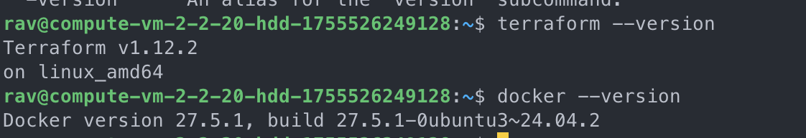
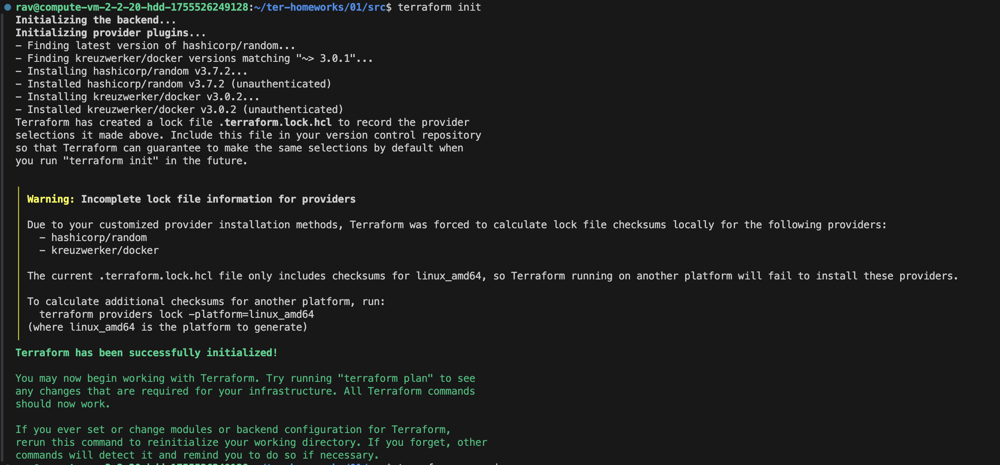
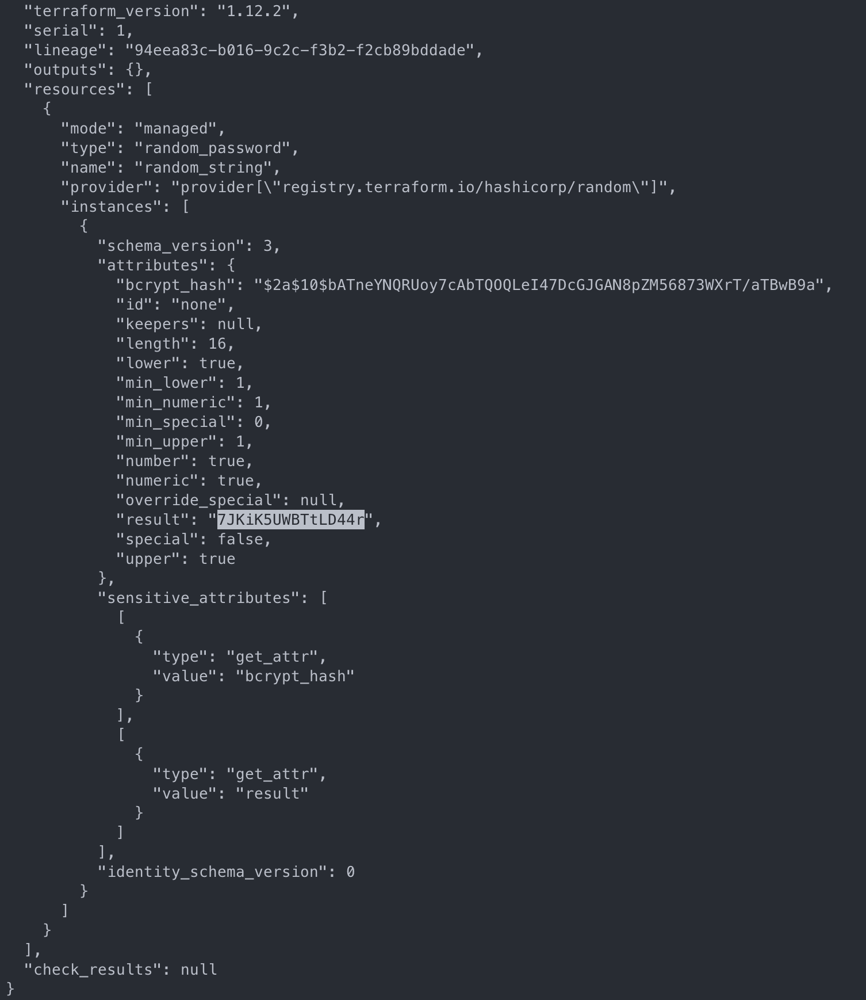
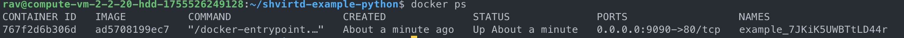
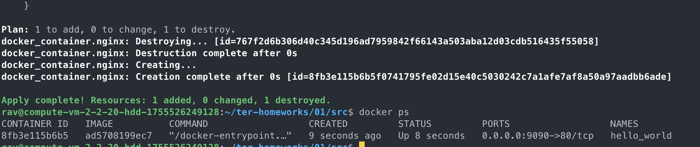
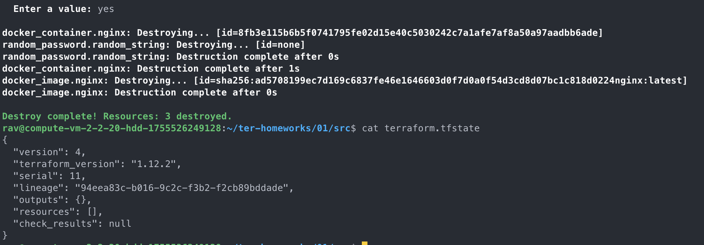

### Задание 1

1.  
2. personal.auto.tfvars
3. "result": "7JKiK5UWBTtLD44r" 
4. Error: Missing name for resource - Отсутсвует второй лейбл
Error: Invalid resource name - Лейбл именуется с цифры, что недопустима
Error: Reference to undeclared resource - Ресурс не описан, описанный выше ресурс имеет иные лейблы
Error: Unsupported attribute - Не поддерживаемый аттрибут. Т.к. регистр иммет значение, указанный в манифесте аттрибут не поддерживается.
5. 
resource "docker_image" "nginx" {
  name         = "nginx:latest"
  keep_locally = true
}

resource "docker_container" "nginx" {
  image = docker_image.nginx.image_id
  name  = "example_${random_password.random_string.result}"

  ports {
    internal = 80
    external = 9090
  }
}
6. в чём может быть опасность применения ключа  ```-auto-approve```.
Отсутвие дополнительного подтверждения, в случае наличия ошибок.
зачем может пригодиться данный ключ?
в случаях полностью автоматизированных сценариях, аналогично ключу "-y" при использовании apt в скриптах или докерфайл.


8. 
9. 
В описании ресурса указана опция keep_locally = true. Опция декларирует, что в значении "true", при уничтожении ресурсов, образ не будет удален из локального хранилища.
Цитата из документации:
keep_locally (Boolean) If true, then the Docker image won't be deleted on destroy operation. If this is false, it will delete the image from the docker local storage on destroy operation.


