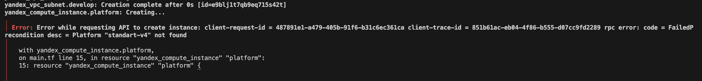
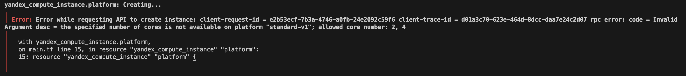
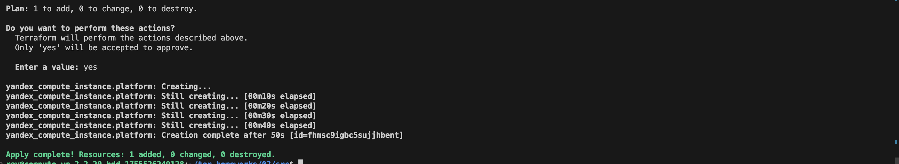
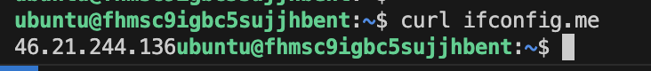
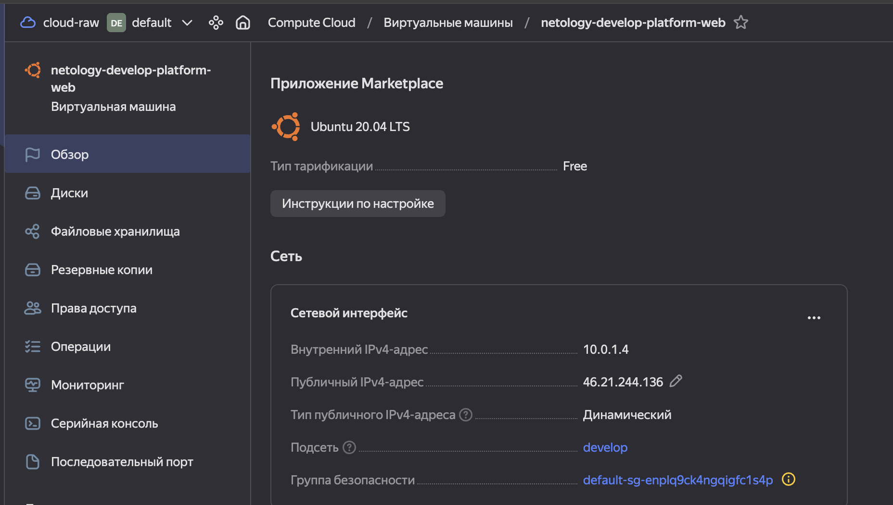
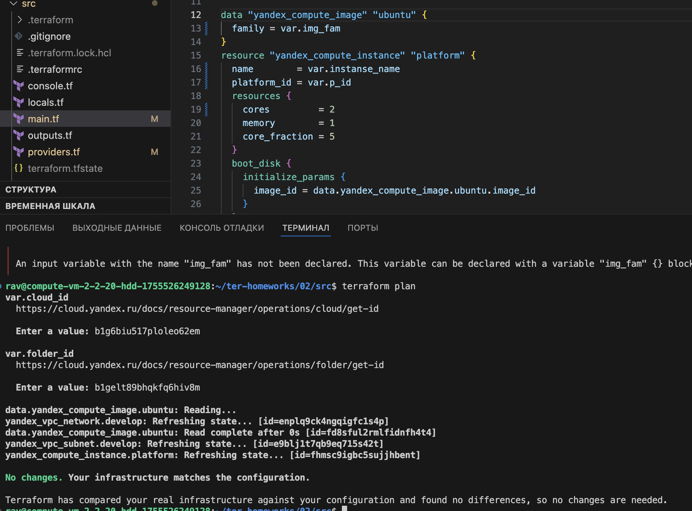
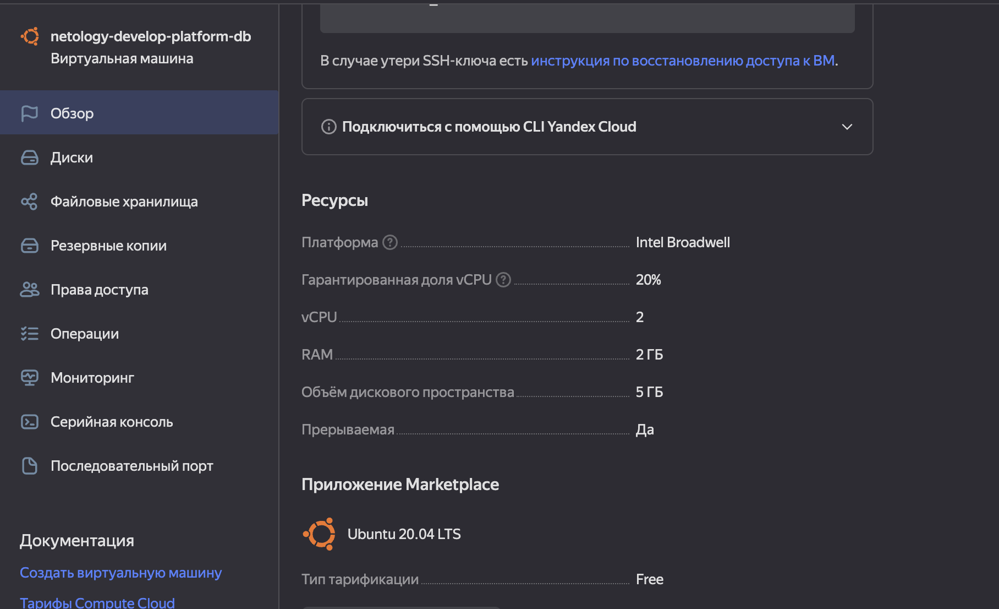
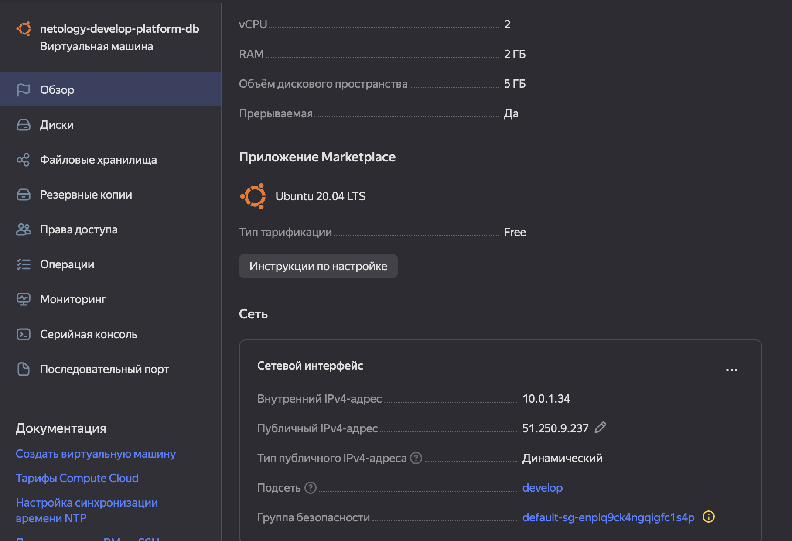
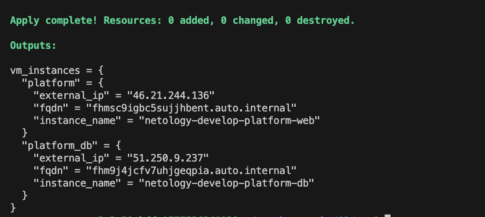

# Задание 1
## Сервисный аккаунт

---
## Ошибки, с которыми столкнулся

Несуществующая платформа:

Требованию к кратности количества ядер:

Успешное выполнение, после правок:

Выполнение ifconfig на созданной ВМ:

Новая ВМ в консоли YC:

## Как в процессе обучения могут пригодиться параметры preemptible = true и core_fraction=5 в параметрах ВМ?
Оба параметра позволяют экономить на инфраструктуре в облаке.
preemptible = true - позволяет создавать прерываемую ВМ. Подойдет, например, для образовательных целей, либо временного наращивания вычислительных мощностей за малый ценник.
core_fraction=5 - гарантированная доля процессора 5%. Подойдет для образовательных целей, позволяет создавать дешевые машины. Для продакшена, как мне кажется, не подойдет, т.к. доля процессора слишком ничтожна, для какой-то полезной деятельности.

# Задание 2

# Задание 3

# Задание 4

# Задание 5

# Задание 6